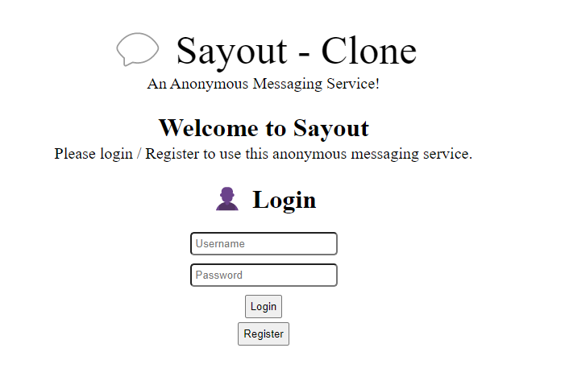

# Sayout - Clone
### Welcome to the full-on tutorial guide on how you can make an anonymous messaging service by yourself!

### In the last part, we have done a few parts of the main webpage (`index.html`). Now, we will do the `login / register` part.

---

## Login System
### We will create a little login form to login users. In the `index.html` file, write the following code:
```html
<body>
    <div id="not-login" class="center">
        <h1 class="center" style="margin-top: 25px;">Welcome to Sayout</h1>
        <p style="font-size: 20px; margin-top: -20px;">Please login / Register to use this anonymous messaging service.</p>
        <form id="login-form">
            <h1>👤 Login</h1>
            <input type="text" name="username" placeholder="Username" id="login_username" style="margin-bottom: 10px; padding: 5px; border-radius: 5px;"><br>
            <input type="password" name="password" placeholder="Password" id="login_password" style="margin-bottom: 10px; padding: 5px; border-radius: 5px;"><br>
            <button type="submit" style="margin-bottom: 5px;">Login</button>
        </form>
        <button id="goto_register_btn">Register</button>
    </div>
    <!-- The below divs are going to be hidden and would be discusses later on -->
    <div id="login" class="center"></div>
    <div id="messages"></div>
</body>
```
### The `not-login` div will render only if the user isn't logged in. To login, the user need to enter the username and password in the `login-form` form.
### After filling all the information, the user would need to click the login button.
### Also, if the user doesn't have an account, he/she would need to click the `register` button to create one.
### **(We would create the `Register` form later on in this tutorial.)**

### Our result would look something like this:


---

## ~~Javascript~~ Typescript behind the login form:
### Firstly, we would need to import the javascript file to our `index.html`.
```html
<head>
    <script src="./index.js" defer></script>
</head>
```

### Now, we would need to add an event listener to our `login-form` form when the user submits the form. In our `index.ts` file, write the following:
```ts
// Get the "username" and "password" fields from the local storage and if they don't exist, set them to empty strings.
if(!localStorage.getItem('username')) localStorage.setItem('username', '')
if(!localStorage.getItem('password')) localStorage.setItem('password', '')

// Get the three divs created above
const not_login = document.querySelector<HTMLDivElement>('#not-login')
const login = document.querySelector<HTMLDivElement>('#login')
const messages = document.querySelector<HTMLDivElement>('#messages')

// Hide the last two divs by adding a "hidden" class name which we created in the last page in 'style.css'
login?.classList.add('hidden')
messages?.classList.add('hidden')

// If the user is logged in, show the `login` div and hide the `not-login` div.
if(localStorage.getItem('username') !== '' && localStorage.getItem('password') !== '') {
    not_login?.classList.add('hidden')
    login?.classList.remove('hidden')
    messages?.classList.remove('hidden')
}

// Get the login form
const login_form = document.querySelector<HTMLFormElement>('#login-form')
// When the form is submitted (the submit button is clicked)
login_form?.addEventListener('submit', (e) => {
    // Get the "username" and "password" fields from the form
    const username = login_form.querySelector<HTMLInputElement>('#login_username')
    const password = login_form.querySelector<HTMLInputElement>('#login_password')

    // If the username OR password fields are empty, show an error message
        if((username?.value === '' || username?.value === null || username?.value === undefined) ||
    (password?.value === '' || password?.value === null || password?.value === undefined)) {
        login_form.reset()
        return alert('Please fill in the required credentials to log in.') 
    }

    e.preventDefault() // Prevent the page from reloading after submitting form

    // Use the 'fetch' function to send a POST request to the server
    fetch('/login', ({
        method: 'POST',
        headers: {
            'Content-Type': 'application/json',
            'Accept': 'application/json'
        },
        body: JSON.stringify({
            username: username.value,
            password: password.value
        })
    }))
    .then(res => res.json())
    .then(data => {
        // If there is an error with the id as 'inv_cred', show an error message that invalid credentials were entered
        if(data.error === 'inv_cred') return alert('Invalid Credentials. Please try again!')
        // Else, set the username and password in the local storage
        localStorage.setItem('username', username.value)
        localStorage.setItem('password', password.value)
        // Show the user is logged in.
        alert('User logged in successfully!')

        // Hide the `not-login` div and show the `login` div
        not_login?.classList.add('hidden')
        login?.classList.remove('hidden')
        messages?.classList.remove('hidden')

        // Welcomes the user
        if(login) login.innerHTML = `
            <h1>Welcome, ${localStorage.getItem('username')}!</h1>
        `
    })
})
```

### You might have noticed we have used a `fetch` keyword to send a POST request to the server.
### The `fetch` function is a promise-based function that allows us to send a request to the server.
### If you click this button now, then you would get an error in your browser console because there is no endpoint for the `/login` route created yet.
### For this, we would need to create a `/login` endpoint.

---

## Login Endpoint
### To create an endpoint, we would need to go to the `server.ts` file which we created at the beginning of this project. In the `server.ts` file, write the following:
```ts
// A '/login' endpoint
app.post('/login', async (req: Request, res: Response) => {
    // Gets the username & password sent by the `fetch` function in 'index.ts'
    const username = req.body.username
    const password = req.body.password

    // Gets the user from the model using the username and password above
    const user = await model.findOne({ username: username, password: password })

    // If no user is found, send an error message with id 'inv_cred' 
    if(!user) return res.send({ error: 'inv_cred' })
    // Else, send the user's messages
    res.send({ msgs: user.msgs })
})
```
### We see the line `await model.findOne({...})` above. This is used for our database. But, we have not connected our database yet. Let's do that.

---

## Read SubTopic: [Connecting Database](./05.1_db.md)
## Read SubTopic: [Root Endpoint](./05.2_root_endpoint.md)
## Read Next: [Creating the Register Form](./06_register.md)

---