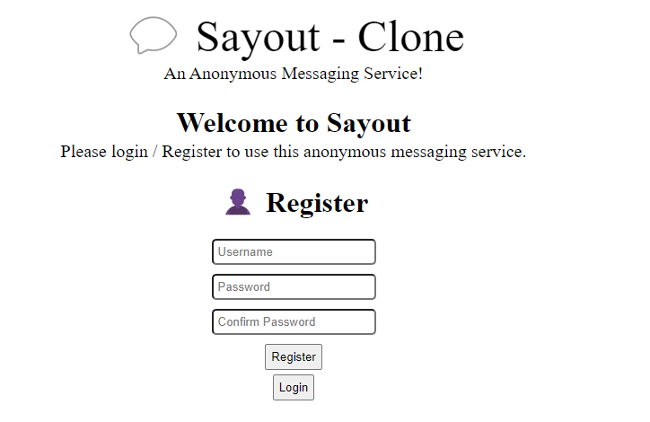

# Sayout - Clone
### Welcome to the full-on tutorial guide on how you can make an anonymous messaging service by yourself!

### In the last part, we have created a login form and an endpoint. Also, we have created the database & connected it to our server. We would create a `register form` in this part!

---

## Register Form
### To create a register form, we first need to add a button to view it. After the `login-form`, we would create a button to view the register form.
```html
<body>
    <div id="not-login" class="center">
        <h1 class="center" style="margin-top: 25px;">Welcome to Sayout</h1>
        <p style="font-size: 20px; margin-top: -20px;">Please login / Register to use this anonymous messaging service.</p>
        <form id="login-form">
            <!-- Login Form Code -->
        </form>
        <button id="goto_register_btn">Register</button>
    <div class="login" class="center"></div>
    <div class="messages"></div>
</body>
```

### Now that we have coded our `goto_register_btn` button, we would write some code for it. In the `index.ts` file, write the following:
```ts
// Get the 'goto_register_btn' button
const goto_register = document.querySelector<HTMLButtonElement>('#goto_register_btn')

// When the button is clicked
goto_register?.addEventListener('click', () => {
    // Hides the login form and shows the register form
    register_form?.classList.remove('hidden')
    login_form?.classList.add('hidden')

    // Hides the 'goto_register_btn' button and shows the 'goto_login_btn' button (will discuss later)
    goto_register?.classList.add('hidden')
    goto_login?.classList.remove('hidden')
})
```

### Now, we would create a `register form` in our `index.ts` file.
```html
<div class="not-login" class="center">
    <!-- Login Form Here -->
    <form id="register-form">
        <h1>👤 Register</h1>
        <input type="text" name="username" placeholder="Username" id="register_username" style="margin-bottom: 10px; padding: 5px; border-radius: 5px;"><br>
        <input type="password" name="password" placeholder="Password" id="register_password" style="margin-bottom: 10px; padding: 5px; border-radius: 5px;"><br>
        <input type="password" name="password" placeholder="Confirm Password" id="register_conf_password" style="margin-bottom: 10px; padding: 5px; border-radius: 5px;"><br>
        <button type="submit" style="margin-bottom: 5px;">Register</button>
    </form>
</div>
```

### The register form would look something like this in the browser (after the end of this part ):


---

## ~~Javascript~~ Typescript behind the register form:
### Now, we would need to add an event listener to our `register-form` form when the user submits the form. In our `index.ts` file, write the following:
```ts
// Gets the register form
const register_form = document.querySelector<HTMLFormElement>('#register-form')
// Hides the register form initially so it would only be visible when clicked the "goto_register_btn" button
register_form?.classList.add('hidden')

// When the form is submitted
register_form?.addEventListener('submit', (e) => {
    // Gets the username, password, and confirm password fields
    const username = register_form.querySelector<HTMLInputElement>('#register_username')
    const password = register_form.querySelector<HTMLInputElement>('#register_password')
    const conf_password = register_form.querySelector<HTMLInputElement>('#register_conf_password')

    // If either one of those are empty, then we would show an error message
    if((username?.value === '' || username?.value === null || username?.value === undefined) ||
    (password?.value === '' || password?.value === null || password?.value === undefined) ||
    (conf_password?.value === '' || conf_password?.value === null || conf_password?.value === undefined)) {
        register_form.reset()
        return alert('Please fill in the required credentials to register.') 
    }

    // Also, if the password and confirm password do not match, then we would show an error message
    if(password.value !== conf_password.value) {
        register_form.reset()
        return alert('Passwords do not match. Please try again!')
    }

    // Prevents the form from reloading the page
    e.preventDefault()
    // Use the 'fetch' function to send a POST request to the server
    fetch('/register', ({
        method: 'POST',
        headers: {
            'Content-Type': 'application/json',
            'Accept': 'application/json'
        },
        body: JSON.stringify({
            username: username.value,
            password: password.value
        })
    }))
    .then(res => res.json())
    .then(data => {
        // If the server gives an error with id 'user_exists', give an error saying that a user already exists with the username
        if(data.error === 'user_exists') return alert('User already exists. Please try again!')

        // Sets the localStorage to the user's data
        localStorage.setItem('username', username.value)
        localStorage.setItem('password', password.value)
        // Sends a message that the user has been registered successfully and then reloads the page
        alert('User registered successfully!')
        window.location.reload()
    })
})
```
### Similar to the login form, we would need to add a `/register` endpoint to our server so the `fetch` method would work.
### In the `server.ts` file, add the following:
```ts
// The `/register` Endpoint
app.post('/register', async(req: Request, res: Response) => {
    // Get the username and password from the request body
    const username = req.body.username
    const password = req.body.password

    // Find if a user with the username already exists
    const user = await model.findOne({ username: username })
    // If so, return an error with id 'user_exists'
    if(user) return res.send({ error: 'user_exists' })
    // Else, create the user with the given data
    await model.create({ username: username, password: password, msgs: [] })
})
```

---

## Returning Back to the Login Form
### If the user wants to go back to the login form again, we would need to add a button to our `index.html` file.
```html
<!-- Register Form Code -->
<button id="goto_login_btn">Login</button>
```

### Now, lets add an event listener when the button is clicked in the `index.ts` file:
```ts
// Gets the 'goto_login_btn' button
const goto_login = document.querySelector<HTMLButtonElement>('#goto_login_btn')

// When the button is clicked
goto_login?.addEventListener('click', () => {
    // Hides the register form and shows the login form
    register_form?.classList.add('hidden')
    login_form?.classList.remove('hidden')

    // Hides the 'goto_login_btn' button and shows the 'goto_register_btn' button
    goto_login?.classList.add('hidden')
    goto_register?.classList.remove('hidden')
})

// Hide the 'goto_login_btn' button initially because we would only show it when the user clicks the 'goto_register_btn' button
goto_login?.classList.add('hidden')
```

---

## Read Next: [User Profiles](./07_profile.md)

---